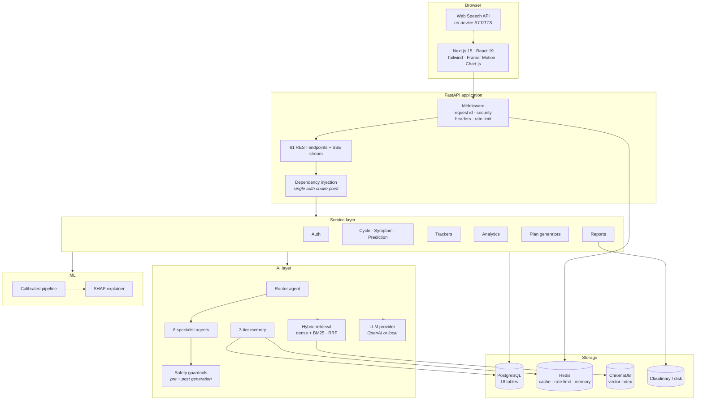
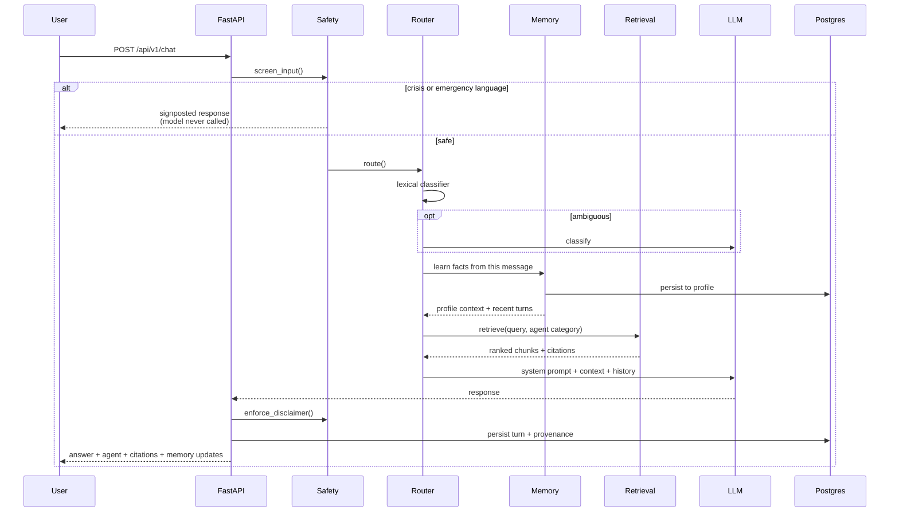

# Oviora AI

**Your Personal AI Companion for Managing PCOS**

An AI copilot for polycystic ovary syndrome: conversational guidance from eight
specialist agents grounded in a curated knowledge base, an explainable risk
model, lab-report parsing, meal-photo analysis, and a full health-tracking
dashboard.

> ### ⚠️ Medical notice
>
> **Oviora does not diagnose any condition.** It provides educational
> information, lifestyle guidance and a screening-level risk *estimate*. Every
> health-related response carries a disclaimer directing the user to a
> qualified clinician, and that disclaimer is **enforced in code**, not left to
> prompt compliance. PCOS is diagnosed by a clinician after examination and
> testing; several other conditions produce overlapping symptoms.

---

## Contents

- [Why this exists](#why-this-exists)
- [What it does](#what-it-does)
- [Architecture](#architecture)
- [Tech stack](#tech-stack)
- [Quick start](#quick-start)
- [Project structure](#project-structure)
- [The AI layer](#the-ai-layer)
- [The ML pipeline](#the-ml-pipeline)
- [Testing](#testing)
- [Engineering decisions worth defending](#engineering-decisions-worth-defending)
- [Deployment](#deployment)
- [Limitations](#limitations)
- [Future scope](#future-scope)

---

## Why this exists

PCOS affects an estimated 8–13% of women of reproductive age, and a large share
of cases go undiagnosed. Surveys repeatedly find that women see three or more
clinicians and wait over two years before receiving a diagnosis.

The reason is structural: each symptom individually has a mundane explanation.
Irregular periods get blamed on stress, acne on adolescence, weight gain on
lifestyle, fatigue on modern life. It is the *combination* that is informative,
and nobody is tracking the combination.

Oviora is built around that gap. It is not a symptom checker that outputs a
verdict. It is a companion that remembers your history, explains what is
happening in plain language, and turns "my periods are a bit irregular" into
three months of structured data a clinician can act on.

---

## What it does

| Capability | What it actually does |
|---|---|
| **Multi-agent chat** | A router dispatches each question to one of eight specialists. Routing runs a lexical classifier first (sub-millisecond) and only consults the LLM when the wording is genuinely ambiguous. |
| **RAG** | Answers are grounded in a curated PCOS corpus using hybrid dense + BM25 retrieval fused by Reciprocal Rank Fusion, with citations. When retrieval finds nothing relevant, the assistant says so rather than inventing an answer. |
| **Memory** | Three tiers — a verbatim window in Redis, a rolling summary in Postgres, structured long-term facts on the profile. Say "I'm 22" on Monday and Friday's meal suggestion accounts for it. |
| **Explainable ML** | A calibrated model estimates PCOS risk; SHAP shows which answers moved the score and by how much, in plain language. |
| **OCR** | Upload a lab report; 18 biomarkers are recognised, unit-converted, and explained against the reference ranges printed on your own report. |
| **Vision** | Photograph a meal for a macro breakdown, glycaemic-load score and one realistic swap. |
| **Voice** | Speech in and out, running on-device in the browser by default. |
| **Tracking** | Cycles, symptoms, habits, meals, workouts, water, sleep, weight and mood. |
| **Analytics** | The whole dashboard in one request: KPI tiles, six chart series, and rule-based insights computed from your own data. |
| **Your data** | Full JSON export and irreversible account deletion, both one click away. |

---

## Architecture



### Request flow — one chat message



More diagrams — the prediction flow, the memory tiers, the database ERD and the
deployment topology — are in [`docs/ARCHITECTURE.md`](docs/ARCHITECTURE.md).

---

## Tech stack

**Frontend** — Next.js 15 (App Router), React 19, TypeScript (strict),
Tailwind CSS, Framer Motion, TanStack Query, Chart.js

**Backend** — FastAPI, Python 3.11, SQLAlchemy 2.0 (async), Pydantic v2,
Alembic

**Data** — PostgreSQL 16, Redis 7, ChromaDB

**ML** — scikit-learn, XGBoost, SHAP, pandas, NumPy

**AI** — pluggable LLM provider (OpenAI, or a built-in local one), hybrid
retrieval, Tesseract OCR

**Infrastructure** — Docker, Docker Compose, GitHub Actions, Ruff, pytest

---

## Quick start

### Docker (everything, one command)

```bash
git clone https://github.com/Rahul0817/AI-Coach.git
cd AI-Coach
cp .env.example .env          # works as-is; no API key required
docker compose up --build
docker compose run --rm trainer   # trains the risk model (~30s)
```

- Frontend → <http://localhost:3000>
- API docs → <http://localhost:8000/docs>

### Local development

```bash
# --- backend ---
cd backend
python -m venv .venv && source .venv/bin/activate
pip install -r requirements-dev.txt
python -m ml.train                      # writes ml/artifacts/
alembic upgrade head                    # needs Postgres running
uvicorn app.main:app --reload

# --- frontend ---
cd frontend
npm install
npm run dev
```

### Running without an OpenAI key

**The entire application works with no credentials.** With
`LLM_PROVIDER=local` (the default), chat is served by a built-in *extractive*
composer that answers from the retrieved knowledge base. Redis and ChromaDB
likewise fall back to in-process implementations.

This is deliberate. An evaluator cloning the repository should get a working
product in one command, and every code path — routing, retrieval, memory,
safety, streaming — is exercised identically on both paths.

To enable a real LLM:

```env
LLM_PROVIDER=openai
EMBEDDING_PROVIDER=openai
OPENAI_API_KEY=sk-...
```

---

## Project structure

```
AI-Coach/
├── backend/
│   ├── app/
│   │   ├── core/            config, database, security, middleware, cache
│   │   ├── models/          17 SQLAlchemy models + dialect-aware types
│   │   ├── schemas/         Pydantic request/response contracts
│   │   ├── repositories/    data access; ownership enforced in SQL
│   │   ├── services/        business logic (12 services)
│   │   ├── api/v1/routes/   61 endpoints
│   │   ├── ai/
│   │   │   ├── llm/         provider abstraction (OpenAI + local)
│   │   │   ├── rag/         loader, vector store, hybrid retriever
│   │   │   ├── agents/      router, specialists, prompts, safety
│   │   │   ├── memory/      three-tier memory + fact extraction
│   │   │   └── multimodal/  OCR, biomarkers, vision, nutrition, voice
│   │   ├── ml/              predictor + SHAP explainer
│   │   └── main.py          app assembly, lifespan, error handlers
│   ├── ml/
│   │   ├── knowledge/       9 curated PCOS documents (the RAG corpus)
│   │   ├── dataset.py       documented cohort generator
│   │   ├── features.py      canonical feature schema (scalar + vectorised)
│   │   └── train.py         full training pipeline
│   ├── alembic/             migrations
│   └── tests/               unit · integration · api (182 tests)
├── frontend/
│   └── src/
│       ├── app/             landing, chat, dashboard, auth
│       ├── components/      ui primitives, chat, dashboard charts
│       ├── hooks/           useChat (SSE), useVoice (Web Speech)
│       ├── lib/             API client with token refresh
│       └── types/           TypeScript mirrors of the API contracts
├── docs/                    architecture + interview guide
└── docker-compose.yml
```

---

## The AI layer

### Multi-agent routing

Eight specialists — Health Expert, Nutrition Coach, Fitness Coach, Mental
Wellness Coach, Blood Report Analyzer, Food Analyzer, Habit Coach, Cycle
Tracker Assistant.

Routing is **two-tier**. A weighted lexical classifier over each agent's
keywords and phrases resolves the large majority of real queries
deterministically, in under a millisecond, for free. Only when no agent clears
the confidence bar — or the top two are within a whisker — is the LLM asked to
classify.

Asking a model "which agent should handle this?" on *every* message would
roughly double latency and cost to answer a question that is usually trivial.

### Retrieval

Dense vector search is strong on paraphrase and weak on rare exact terms; BM25
is the mirror image. Oviora runs both and fuses them with **Reciprocal Rank
Fusion**, which merges on rank rather than score — necessary because cosine
similarity and BM25 live on incomparable scales.

Each embedding provider declares its own **measured** score floor and fusion
weight, because a semantic encoder puts genuine matches around 0.3–0.6 while a
lexical embedder puts the same matches near 0.08.

### Safety

Prompt instructions are guidance. For the two failure modes that matter, the
behaviour is enforced in code:

- **Crisis detection runs before generation.** Language suggesting self-harm or
  a medical emergency never reaches the model; a signposted response with real
  helpline numbers is returned instead.
- **The disclaimer is verified after generation** and appended if absent —
  including mid-stream, where prompt compliance cannot be checked.

Prompt sentinels in user input are also neutralised, so a user cannot paste a
forged citation and have the local composer treat it as retrieved knowledge.

### Memory

| Tier | Store | Purpose |
|---|---|---|
| Working window | Redis | Last N turns verbatim — makes "and for dinner?" work |
| Rolling summary | Postgres | Older turns compressed, so threads continue at bounded cost |
| Long-term facts | Postgres (JSONB) | Age, height, diet, goals — survives across conversations |

Fact extraction is **deterministic**, not LLM-based, for the critical fields.
Memory is a correctness feature: a model that occasionally hallucinates a
user's age into permanent storage produces confidently wrong answers for the
life of that account. The extractor handles negation ("I'm *not* vegetarian")
and third-person attribution ("my *sister* is 30").

---

## The ML pipeline

```bash
cd backend && python -m ml.train
```

Nine stages: load → engineer → stratified split → build pipelines →
cross-validate → select → **calibrate** → evaluate → persist.

**Model selection** compares Logistic Regression, Random Forest and XGBoost by
mean cross-validated ROC-AUC. AUC rather than accuracy, because the classes are
imbalanced and accuracy would reward predicting the majority class.

**Holdout results** (1,200 unseen rows):

| Model | CV ROC-AUC | Accuracy | Precision | Recall | F1 |
|---|---|---|---|---|---|
| **Logistic Regression** ✅ | **0.930** | 0.897 | 0.866 | 0.803 | 0.833 |
| Random Forest | 0.924 | — | — | — | — |
| XGBoost | 0.921 | — | — | — | — |

Brier score **0.082** after isotonic calibration. Calibration matters because
the score is shown to a user as a percentage — "70% risk" has to actually mean
something, not merely rank correctly.

Logistic regression winning is not a disappointing result to explain away: the
generative process is largely additive, and a linear model recovering it while
the ensembles overfit slightly is exactly what you would predict.

**Explainability.** Every prediction ships with a SHAP breakdown. The naive
configuration measured **7.5 seconds** per explanation — unusable in a request
path. Compressing the background to 20 k-means centroids returns the same
ranked factors in **~36 ms**. The explanation *text* is composed from a curated
table, never generated, so the app cannot hallucinate a clinical claim about a
user's own data.

**Scores are clamped to [0.02, 0.97].** Isotonic calibration saturates at
exactly 1.0, and telling someone a questionnaire proves 100% certainty would be
statistically indefensible and clinically irresponsible.

---

## Testing

```bash
cd backend && pytest tests -v --cov=app --cov=ml
```

**182 tests, 72% coverage.**

| Layer | Count | What it covers |
|---|---|---|
| Unit | 109 | Hashing, JWT semantics, feature engineering, routing, memory extraction, safety, BMI/streak maths, meal scoring, biomarker parsing |
| Integration | 15 | Real database: ownership enforcement, cascade deletion, upserts, SQL aggregation, sequence monotonicity |
| API | 58 | Real HTTP: auth flows, IDOR protection, memory persistence, crisis short-circuit, prediction bounds, plan constraints, error contract |

Integration tests run against a real database rather than mocks, because the
layer most likely to break — queries, constraints, cascades — is exactly what a
mock replaces with a no-op.

**The suite caught four real defects**, each documented in
[`docs/INTERVIEW_GUIDE.md`](docs/INTERVIEW_GUIDE.md#bugs-found-by-testing).
The most instructive: a train/serve skew where the vectorised training path and
the scalar inference path disagreed in the fourth decimal on ~0.5% of rows,
because Python floats and numpy float64 round half-way values differently.

---

## Engineering decisions worth defending

**Deterministic plan generation, not LLM.** A meal plan has to add up, and an
allergy exclusion has to hold with *certainty*, not high probability. An LLM
asked for 1,800 kcal will confidently produce 2,340 and the user cannot tell.
The macros come from the same food database the tracker uses. The LLM's job
here is conversation; where arithmetic and hard constraints are the value, code
wins.

**Rule-based dashboard insights.** They must be deterministic enough to test
and must never state a number that contradicts the chart beside them.

**Repository pattern with ownership in SQL.** `get_for_user()` filters by owner
in the query itself, so a handler that forgets to compare `user_id` still
cannot leak data. IDOR is closed by construction, not by review.

**Graceful degradation everywhere.** A missing ML artifact disables the
prediction endpoints and nothing else. Redis, ChromaDB and the LLM all have
working fallbacks. Coupling every feature to one dependency is a bad
availability trade.

**Two-tier routing, cheap path first.** The same pattern appears throughout:
resolve the common case deterministically, escalate only the hard case.

---

## Deployment

`docker compose up --build` brings up Postgres, Redis, the API and the
frontend, with health-gated startup so the API does not race the database on a
fresh clone.

The backend image is multi-stage — compilers stay in the build stage, the
runtime carries the venv plus Tesseract and Poppler, and the process runs as a
non-root user. The frontend uses Next.js standalone output, which traces only
the modules actually imported.

CI runs lint, the full test suite against real Postgres and Redis, a frontend
build, a dependency audit, a secret scan, and a Docker build that **starts the
image and waits for it to serve**. A drift check fails the build when models
change without a migration.

Full guide: [`docs/DEPLOYMENT.md`](docs/DEPLOYMENT.md).

---

## Limitations

Stated plainly, because a project that hides these is harder to trust.

1. **The model trains on a synthetic cohort.** Real PCOS datasets carry
   licences that forbid redistribution inside an application repository, so
   `ml/dataset.py` simulates one from a documented latent-variable causal model
   with literature-informed conditional prevalences and 4% label noise. **The
   metrics show the pipeline recovers the generative structure — they are not
   clinical validation.** Dropping a licensed CSV at `ml/data/pcos_dataset.csv`
   switches over with no code change.

2. **The knowledge base is curated, not exhaustive.** Nine documents written as
   original educational summaries. It is a demonstration of a working RAG
   pipeline, not a medical reference.

3. **The local LLM fallback is extractive.** It quotes the corpus rather than
   generating prose. That is the correct trade for a health product without a
   model, but it is not conversational.

4. **Vision without a configured model does not read pixels.** It says so
   explicitly and works from a description instead.

5. **Tokens are stored in `localStorage`.** For a production healthcare
   deployment, httpOnly cookies behind a same-origin BFF proxy is the stronger
   design; the mitigation here is short-lived access tokens and server-side
   revocation.

6. **No formal clinical review.** Content is written from public educational
   sources. A real product in this space needs sign-off from a clinician.

---

## Future scope

- Swap in a licensed clinical dataset and re-validate
- Clinician review of all knowledge-base content
- Wearable integration (Apple Health, Google Fit) for passive tracking
- Longitudinal risk modelling — trajectory rather than a point estimate
- A clinician-facing view for sharing tracked data at appointments
- Multilingual support, starting with Hindi and Tamil
- Native mobile apps with push reminders
- Community features with strong moderation

---

## Documentation

| Document | Contents |
|---|---|
| [`docs/ARCHITECTURE.md`](docs/ARCHITECTURE.md) | System, data, ML, RAG, memory and deployment diagrams |
| [`docs/INTERVIEW_GUIDE.md`](docs/INTERVIEW_GUIDE.md) | Technical deep-dive, 20 Q&As, and a 5-minute walkthrough |
| [`docs/DEPLOYMENT.md`](docs/DEPLOYMENT.md) | Production deployment and operations |
| `/docs` (running app) | Interactive Swagger UI for all 61 endpoints |

---

## Licence

MIT. Educational software — **not a medical device.**
