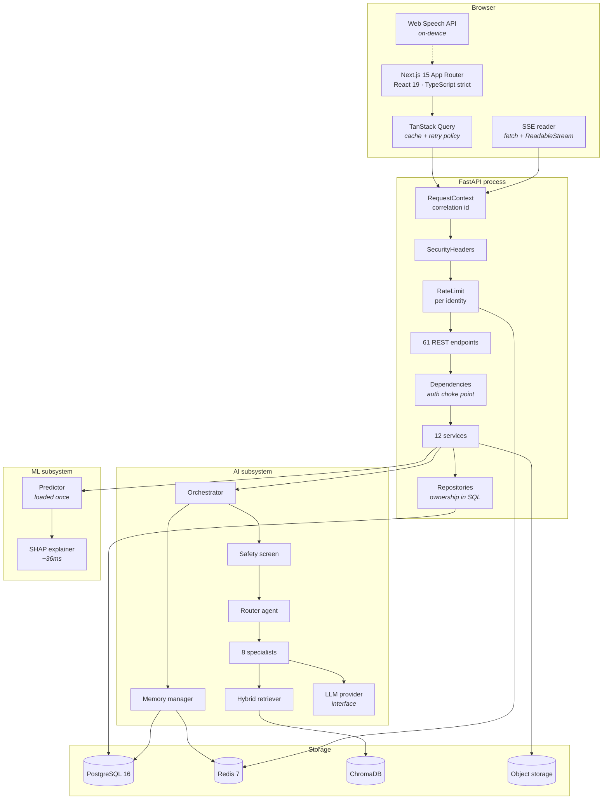
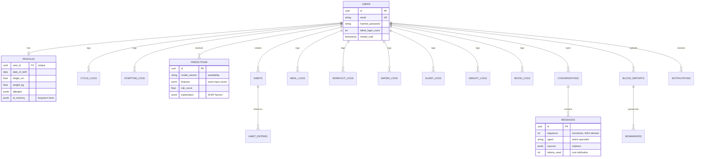
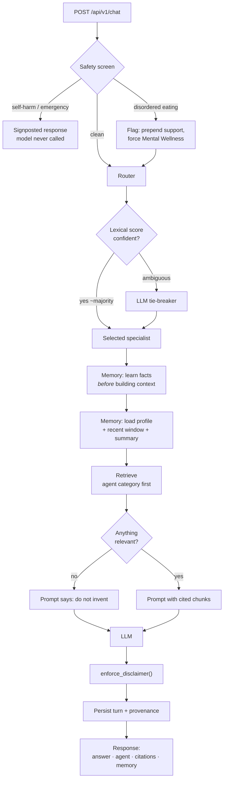
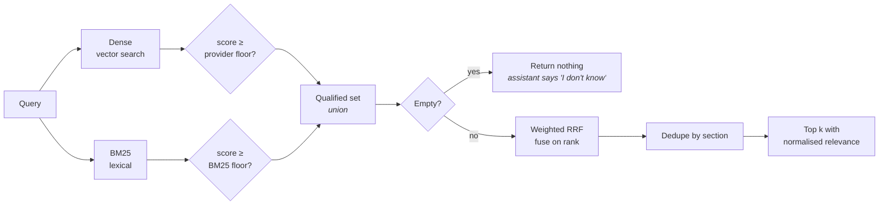
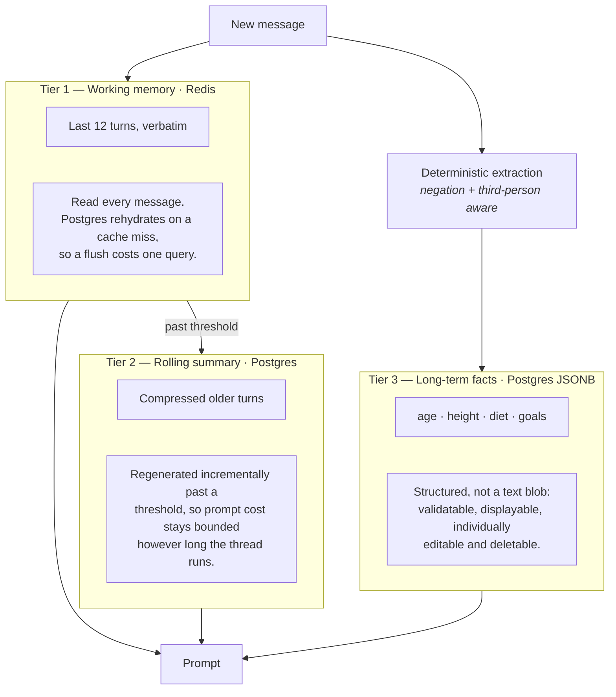
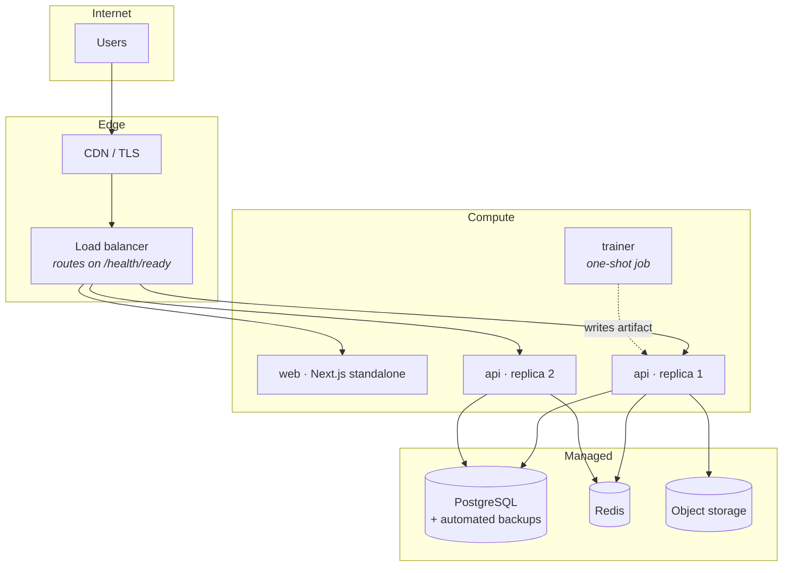
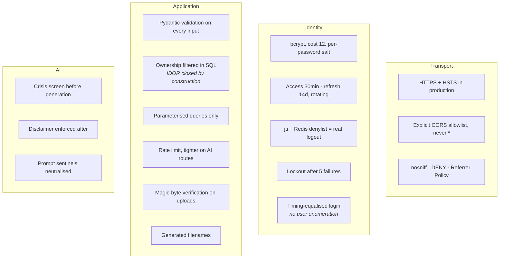

# Oviora AI — Architecture

Diagrams and the reasoning behind each design. Companion to the
[README](../README.md) and the [interview guide](INTERVIEW_GUIDE.md).

---

## 1. System overview

**Why the layers are separated this way.** Services raise domain exceptions and
never import `HTTPException`, so exactly one place maps meaning to status
codes. That is what would let the same services be driven by a CLI, a worker or
a gRPC surface without change.

---

## 2. Database schema

Eighteen tables. Design points:

- **UUID primary keys.** Generatable client-side, and they do not leak business
  volume the way `/users/1043` does.
- **`ondelete="CASCADE"` on every user-owned table.** Right-to-erasure is
  implemented at the database level, so no application bug can leave orphaned
  PHI behind.
- **Split `users` / `profiles`.** The login path reads a small hot table, and
  sensitive health attributes stay out of the row loaded on every request.
- **`predictions` stores the feature vector and model version.** Months later
  you can answer "why did the model say that?" and reproduce it exactly.
- **`messages.sequence` derived from `MAX`, not `COUNT`.** Deleting a message
  cannot then cause a collision.
- **Dialect-aware types.** `JSONB` and native `uuid` on Postgres, portable
  equivalents on SQLite, via `with_variant` — so the test suite runs against
  the same schema definition.

---

## 3. Chat request flow

Facts are learned **before** context is assembled, so "I'm 22, what should I
eat?" personalises *that* answer rather than only the next one.

---

## 4. Retrieval — why hybrid

| Failure mode | Dense | BM25 | Hybrid |
|---|---|---|---|
| "I keep skipping periods" → *oligomenorrhoea* | ✅ | ❌ | ✅ |
| "What is HOMA-IR?" (rare exact term) | ❌ | ✅ | ✅ |

**The bug this design fixed.** The first version filtered by an absolute cosine
threshold *after* truncating to top-k, and returned nothing for obviously
answerable questions. Two changes: gate before truncation, and let each
embedding provider declare its own measured floor and fusion weight — a
semantic encoder scores genuine matches around 0.3–0.6, a lexical one around
0.08, and a single global threshold silently starves one of them.

---

## 5. Memory tiers

Extraction is deterministic rather than model-based for the critical fields.
Memory is a *correctness* feature: a hallucinated age poisons every future
answer for that account, permanently.

---

## 6. ML pipeline

```mermaid
flowchart LR
    A["Load dataset<br/><i>real CSV if present,<br/>else documented synthetic</i>"] --> B["Engineer 19 features<br/><i>vectorised</i>"]
    B --> C["Stratified 80/20 split"]
    C --> D["3 pipelines<br/><i>preprocessing inside</i>"]
    D --> E["5-fold CV<br/>select on ROC-AUC"]
    E --> F["Isotonic calibration"]
    F --> G["Holdout evaluation"]
    G --> H["Persist artifact +<br/>metrics + background sample"]

    H --> I["Load once at startup"]
    I --> J["predict()"]
    J --> K["clamp to [0.02, 0.97]"]
    K --> L["SHAP explain ~36ms"]
    L --> M["Curated text + recommendations"]
```

**Preprocessing lives inside the pipeline.** Fitting a scaler outside it is the
classic source of train/serve skew — the scaler would be re-fit, or not fit at
all, at inference time.

**Four engineered features** encode clinical structure a tree would otherwise
have to rediscover from limited data: androgenic symptom *count* (the pattern
matters more than any single marker), metabolic load (a hand-built interaction
term), cycle deviation (absolute, since both 19-day and 45-day cycles are
abnormal), and lifestyle score (the modifiable slice, which is what the
coaching agents can act on).

---

## 7. Deployment topology

**One uvicorn worker per container.** The ML model and the embedded knowledge
base are loaded per process, so scaling by adding containers keeps each one's
memory footprint predictable — multiple workers would multiply that footprint
inside a single memory limit.

**Liveness and readiness are separate.** Liveness touches no dependency, so a
transient database blip cannot cause the orchestrator to kill an otherwise
healthy pod; readiness checks dependencies so the load balancer stops routing
to a pod that cannot serve.

---

## 8. Security

| Threat | Mitigation |
|---|---|
| Credential stuffing | Lockout with backoff; strong password policy |
| User enumeration | Identical error and comparable timing on both failure paths |
| Token theft | Short access tokens; rotation makes a stolen refresh token single-use |
| IDOR | Ownership in the query, not in a handler check |
| SQL injection | ORM parameterisation throughout |
| Malicious upload | Declared MIME verified against magic bytes; generated names |
| Prompt injection | Sentinels stripped; safety rules restated last in the prompt |
| Data leakage in SSR | QueryClient per request, never at module scope |
